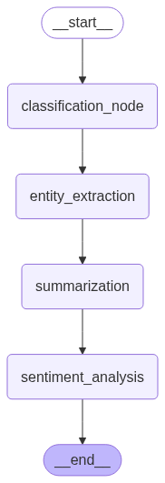
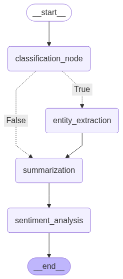
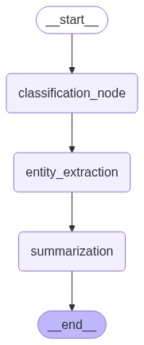

# LangGraph Text Analysis Pipeline
A modular text analysis pipeline built with LangGraph and LangChain.
---

## Setup & installation

### 1. Clone the Repository
```bash
git clone https://github.com/Goodnight77/langgraph_text_analysis.git
cd langgraph_text_analysis
```

### 2. Create a virtual Environment
``` bash
python -m venv venv
source venv/bin/activate  # On Windows: venv\Scripts\activate
```
### 3. Install Dependencies
```
pip install -r requirements.txt
```
### 4. Configure Environment Variables
Copy .env.example to .env and add your API keys and configurations.

```bash
cp .env.example .env
```
## Running Examples 
### Run Basic Pipeline
```bash
python examples/basic_pipeline.py
```
### Run Enhanced Pipeline (with Sentiment Analysis)
```bash
python examples/enhanced_pipeline.py
```
### Run Conditional Pipeline
```bash
python examples/conditional_pipeline.py
```
### Running Tests
```bash
pytest tests/
```

## project structure 
```
langgraph_text_analysis/
├── requirements.txt
├── README.md
├── .env.example
├── src/
│   ├── __init__.py
│   ├── config.py          # Environment configuration
│   ├── models.py          # State definitions
│   ├── nodes.py           # Analysis node functions
│   ├── workflows.py       # Workflow definitions
│   └── utils.py           # Utility functions
├── examples/
│   ├── __init__.py
│   ├── basic_pipeline.py     # Basic pipeline example
│   ├── enhanced_pipeline.py  # Enhanced pipeline with sentiment
│   ├── conditional_pipeline.py # Conditional routing example
│   └── test_samples.py       # Sample texts for testing
└── tests/
    ├── __init__.py
    └── test_workflows.py     # Basic workflow tests
```


## How It Works
### Basic Pipeline Flow

```
Classification → 2. Entity Extraction → 3. Summarization
```


### Enhanced Pipeline Flow

```
Classification → 2. Entity Extraction → 3. Summarization → 4. Sentiment Analysis
```



### Conditional Pipeline Flow

```
Classification →

If News/Research: Entity Extraction → Summarization → Sentiment Analysis
If Blog/Other: Summarization → Sentiment Analysis
```



### Simple Workflow Graph


## References
*   [LangGraph Documentation](https://python.langchain.com/docs/langgraph)
*   [LangChain Documentation](https://python.langchain.com/docs)

## Contributing
Feel free to contribute to this project by submitting pull requests, reporting issues, or suggesting new features.
